# Diagrama de Casos de Uso - Los Patismos

## Sistema de Gestión de Librería

```mermaid
graph TB
    subgraph Sistema["Sistema Los Patismos"]
        %% Casos de uso del Usuario
        CU01[Buscar Libro]
        CU02[Filtrar por Categoría]
        CU03[Ver Detalle del Libro]
        CU04[Agregar al Carrito]
        CU05[Ver Carrito]
        CU06[Realizar Compra]
        CU07[Ver Recomendaciones]
        CU08[Iniciar Sesión]
        CU09[Registrarse]
        
        %% Casos de uso del Gerente
        CU10[Gestionar Libros]
        CU11[Gestionar Stock]
        CU12[Gestionar Usuarios]
        CU13[Ver Estadísticas]
        CU14[Ver Resumen General]
        CU15[Agregar Categorías]
        CU16[Restockear Libros]
        CU17[Ver Alertas de Stock Bajo]
    end

    %% Actores
    Usuario[👤 Usuario/Comprador]
    Gerente[💼 Gerente/Administrador]
    SistemaPago[💳 Sistema de Pago]
    SistemaNotif[🔔 Sistema de Notificaciones]

    %% Relaciones Usuario
    Usuario --> CU01
    Usuario --> CU02
    Usuario --> CU03
    Usuario --> CU04
    Usuario --> CU05
    Usuario --> CU06
    Usuario --> CU07
    Usuario --> CU08
    Usuario --> CU09

    %% Relaciones Gerente
    Gerente --> CU10
    Gerente --> CU11
    Gerente --> CU12
    Gerente --> CU13
    Gerente --> CU14
    Gerente --> CU15
    Gerente --> CU16
    Gerente --> CU17

    %% Relaciones con sistemas externos
    CU06 --> SistemaPago
    CU11 --> SistemaNotif
    CU17 --> SistemaNotif

    %% Include relationships
    CU06 -.->|include| CU05
    CU06 -.->|include| CU08
    CU16 -.->|include| CU11
    CU10 -.->|include| CU11

    %% Extend relationships
    CU01 -.->|extend| CU02
    CU03 -.->|extend| CU04
    CU13 -.->|extend| CU14

    %% Estilos
    classDef userCase fill:#ebf4ff,stroke:#667eea,stroke-width:2px
    classDef adminCase fill:#f0fff4,stroke:#38a169,stroke-width:2px
    classDef actor fill:#fffaf0,stroke:#dd6b20,stroke-width:2px
    classDef external fill:#faf5ff,stroke:#805ad5,stroke-width:2px

    class CU01,CU02,CU03,CU04,CU05,CU06,CU07,CU08,CU09 userCase
    class CU10,CU11,CU12,CU13,CU14,CU15,CU16,CU17 adminCase
    class Usuario,Gerente actor
    class SistemaPago,SistemaNotif external
```

## Descripción del Diagrama

### Actores

| Actor | Descripción |
|-------|-------------|
| **Usuario/Comprador** | Cliente de la librería que accede al catálogo digital para buscar, filtrar y comprar libros |
| **Gerente/Administrador** | Propietario o encargado de la librería que gestiona el inventario, usuarios y visualiza estadísticas |
| **Sistema de Pago** | Sistema externo que procesa las transacciones de compra |
| **Sistema de Notificaciones** | Sistema que envía alertas de stock bajo y notificaciones de préstamos |

### Casos de Uso del Usuario

| ID | Caso de Uso | Descripción |
|----|-------------|-------------|
| CU-01 | Buscar Libro | El usuario busca libros por nombre o autor |
| CU-02 | Filtrar por Categoría | El usuario filtra el catálogo por categorías (Ficción, Arte, Tecnología, etc.) |
| CU-03 | Ver Detalle del Libro | El usuario ve información completa de un libro |
| CU-04 | Agregar al Carrito | El usuario agrega un libro al carrito de compras |
| CU-05 | Ver Carrito | El usuario ve los libros en su carrito |
| CU-06 | Realizar Compra | El usuario finaliza la compra de los libros en el carrito |
| CU-07 | Ver Recomendaciones | El usuario ve recomendaciones personalizadas |
| CU-08 | Iniciar Sesión | El usuario inicia sesión en el sistema |
| CU-09 | Registrarse | El usuario crea una cuenta nueva |

### Casos de Uso del Gerente

| ID | Caso de Uso | Descripción |
|----|-------------|-------------|
| CU-10 | Gestionar Libros | CRUD completo de libros del catálogo |
| CU-11 | Gestionar Stock | Actualizar cantidades y ver disponibilidad |
| CU-12 | Gestionar Usuarios | CRUD de usuarios/compradores |
| CU-13 | Ver Estadísticas | Visualizar estadísticas de ventas y tendencias |
| CU-14 | Ver Resumen General | Dashboard con métricas principales |
| CU-15 | Agregar Categorías | Crear nuevas categorías de libros |
| CU-16 | Restockear Libros | Agregar unidades al inventario |
| CU-17 | Ver Alertas de Stock Bajo | Ver libros con stock bajo o agotados |

### Relaciones

- **Include**: Un caso de uso siempre incluye otro (ej: Realizar Compra siempre incluye Ver Carrito)
- **Extend**: Un caso de uso puede extender otro opcionalmente (ej: Buscar Libro puede extenderse con Filtrar por Categoría)
